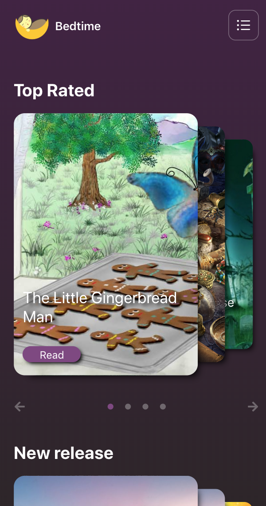
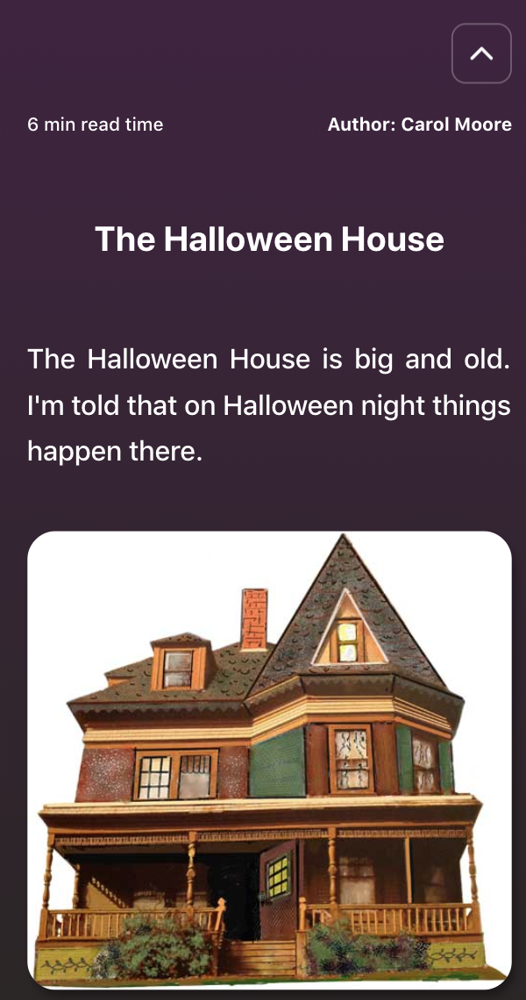
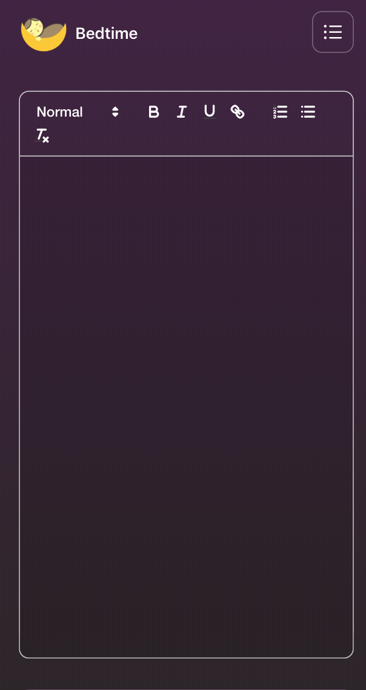

## Bedtime-client 
[LIVE DEMO](https://bedtime-app.olegakan5326.now.sh/#/)

The app is not only a collection of a kids stories, but a platform where useres can publish their own ones. 

## Setting up

```sh
git clone https://github.com/olegakan/bedtime-client.git
npm install
npm test
npm start
```

## Server API
[Link](https://github.com/olegakan/bedtime-server)

If you have any suggestions or encountring any issues with api requests please check out [API issues tab](https://github.com/olegakan/bedtime-server/issues)

## Issues

Looking to contribute? Pick an issue from the [issues](https://github.com/olegakan/bedtime-client/issues) tab.

## Feature Requests

Please file an [issue](https://github.com/olegakan/bedtime-client/issues) to suggest new features. Vote by adding 👍 on feature request to help us prioritize what to work on.

## Screenshots

<div style='
  display: flex;
  justify-content: space-around;
  flex-wrap: wrap;
'>
  
  
  
</div>
